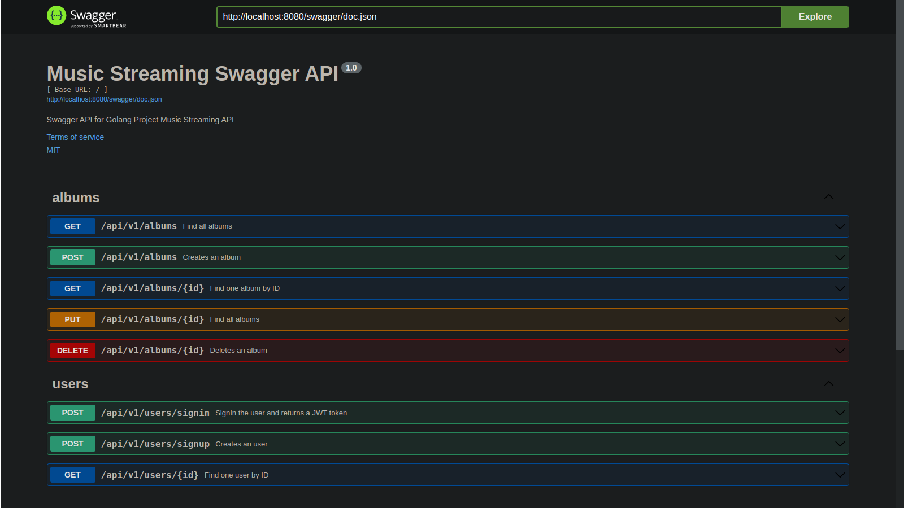

# Music streaming API

Simple Web Restful API made with Golang, MongoDB and Chi framework

## Prerequisites

- Go 1.22 or higher
- MongoDB 

## Project Features

| Feature                              | Status       |
| -----------------------------------  | ------------ |
| Consistent API design                | 🟢 Ready     |
| Use of DTOs                          | 🟢 Ready     |
| Authentication with JWT              | 🟢 Ready     |
| Caching with Redis                   | 🔴 Not Ready |
| Data generation                      | 🟢 Ready     |
| Documentation with SwaggerUI         | 🟢 Ready     |
| Pagination, sorting and searching    | 🟢 Ready     |
| Mailing service                      | 🔴 Not Ready |
| Layered architecture                 | 🟢 Ready     |
| Error Handling                       | 🟢 Ready     |
| API versioning                       | 🟢 Ready     |
| Excel, CSV and PDF exporting         | 🔴 Not Ready |
| File upload and download             | 🔴 Not Ready |
| Rate Limiting                        | 🔴 Not Ready |
| Data Encryption                      | 🟢 Ready     |
| Asynchronous/ brackground tasks      | 🔴 Not Ready |
| Logging                              | 🟢 Ready     |
| CI/ CD with Docker and Railway       | 🟢 Ready     |


## Getting Started

#### Clone the repository:

```bash
git clone https://github.com/athirsonsilva/music-streaming-api.git
```

#### Navigate to the project directory:

```bash
cd music-streaming-api
```

#### Install the dependencies:

```bash
go mod download
```

#### Build and run the project:

```bash
go build -o app ./cmd/server/main.go && ./app
```

#### The API will start running on http://localhost:8080.

## Documentation

The API documentation is available at http://localhost:8080/swagger/index.html

